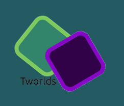

  
  
   
  
  
  
   
  

# Tworlds

A game of two worlds, light and dark, and a player with the power to travel between these worlds.

A puzzle/platformer game where you take control of the player and use their powers to reach the portals at the end of each levels. 
Can you do it?

<a href="https://vtg2000.itch.io/tworlds"> Download the game here </a>

---
## Screenshots

---
# Contributors
This project was created as part of the <b>itch.io United Game Jam</b> by

Anay Kulkarni - [anay121](https://github.com/Anay121)

Vignesh Viswanathan - [vtg2000](https://github.com/vtg2000)

---

### License
This project is licensed under the MIT - check out the [LICENSE](./LICENSE) file for details.
